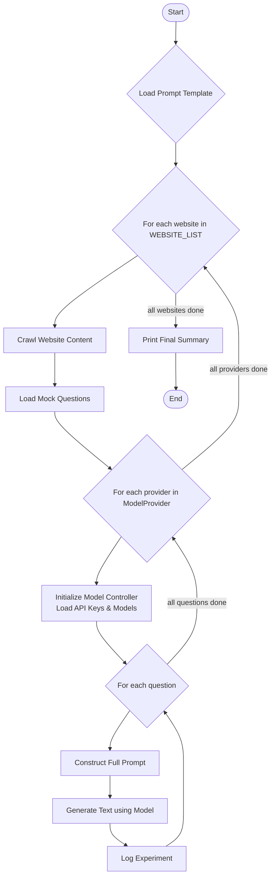

# Backend LLM Evaluation Pipeline

This backend is designed to evaluate the performance of various Large Language Models (LLMs) on a question-answering task. It automatically crawls content from specified websites, poses a series of questions to different LLM providers (Gemini, OpenAI, and Ollama), and logs the results for analysis.

## Features

- **Multi-Provider Support**: Easily switch between and evaluate models from Google (Gemini), OpenAI, and local Ollama instances.
- **Automated Content Crawling**: Uses `crawl4ai` to fetch and parse content from websites into a clean Markdown format.
- **Flexible Question Loading**: Loads questions from dedicated text files for each target website.
- **Resilient API Handling**: Implements API key rotation to gracefully handle authentication errors and continue the evaluation.
- **Detailed Logging**: Saves all experiment data, including timestamps, websites, questions, models, and generated outputs, to a `experiments.jsonl` file.

## Workflow

The diagram below illustrates the complete workflow of the evaluation pipeline.



## Setup and Installation

Follow these steps to set up and run the backend pipeline.

### 1. Prerequisites

- Python 3.8 or higher
- Access to API keys for the desired LLM providers (Gemini, OpenAI).
- (Optional) A running Ollama instance for local model evaluation.

### 2. Installation

1.  **Navigate to the backend directory:**
    From the root of the project (`IOSL-2025-2026-Better-Readability-for-LLMs`), move into the `backend` directory.
    ```bash
    cd backend
    ```

2.  **Create and activate a virtual environment:**
    ```bash
    python -m venv venv
    source venv/bin/activate  # On Windows, use `venv\Scripts\activate`
    ```

3.  **Install the required dependencies:**
    *Note: Make sure you have a `requirements.txt` file (not `reqiurements.txt`).*
    ```bash
    pip install -r requirements.txt
    ```

### 3. Environment Configuration

The pipeline requires a `.env` file inside the `backend` directory to store API keys and model configurations.

Create a `.env` file in the `backend` directory and add the variables as specified in the `helper_classes/model_controller.py` docstring.

## Usage

To run the full evaluation pipeline, simply execute the `pipeline.py` script from within the `backend` directory:

```bash
python pipeline.py
```

The script will:
1.  Crawl the websites listed in `WEBSITE_LIST` inside `pipeline.py`.
2.  For each website, load questions from the corresponding file in the `questions/` directory.
3.  Cycle through all configured `ModelProvider`s.
4.  Print a live summary of the progress to the console.
5.  Log detailed results to `experiments.jsonl` in the `backend` directory.

## Input Data and Configuration

To customize the evaluation, you need to configure the following inputs correctly.

### 1. Website List

Open `pipeline.py` and modify the `WEBSITE_LIST` to include the URLs of the websites you want to crawl.

```python
# inside pipeline.py
WEBSITE_LIST = [
    "https://www.example.com",
    "https://www.another-site.org"
]
```

### 2. Question Files

For each website in `WEBSITE_LIST`, you must provide a corresponding question file in the `backend/questions/` directory.

-   **Naming Convention**: The filename is derived from the website URL by removing `https://` and replacing all `.` characters with `_`. For example:
    -   `https://www.google.com` requires a file named `www_google_com.txt`.
    -   `https://openai.com` requires a file named `openai_com.txt`.

-   **Format**: Each file should contain one question per line. Blank lines and leading/trailing whitespace are ignored.

    *Example: `backend/questions/www_google_com.txt`*
    ```
    What is the main purpose of Google Search?
    How does Google rank search results?
    ```

### 3. Prompt Template

The prompt sent to the LLMs is constructed from a template file. The path to this file is defined by `PROMPT_PATH` in `pipeline.py` (e.g., `../src/prompts/summary_prompt.txt`).

This file should contain the base text for your prompt. The script will automatically append the crawled website content and the specific question to this text before sending it to the model.

## Project Structure

The project root is the `IOSL-2025-2026-Better-Readability-for-LLMs` folder. The instructions assume you are running commands from within the `backend` directory.

-   `pipeline.py`: The main script that orchestrates the entire evaluation process.
-   `helper_classes/`: Contains helper classes like the `ModelController`.
-   `questions/`: This directory (located inside `backend`) should contain your `.txt` files with questions.
-   `experiments.jsonl`: The output log file. It will be created inside the `backend` directory upon running the pipeline.
-   `../src/prompts/`: The pipeline reaches out to this directory (relative from `backend`) to get prompt templates.