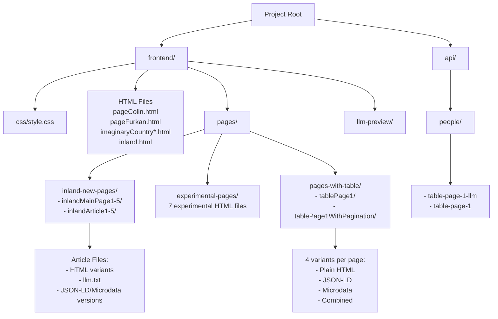

# Frontend General Design

This frontend is designed to showcase structured HTML content enhanced with semantic metadata using JSON-LD, Microdata, and their combination. It simulates real-world content scenarios like articles and data tables, distributed across multiple structured pages. This content is later evaluated using LLMs in a separate backend pipeline.

## Features

- **Structured Data Variants**: Structured Data Variants: Each content page is available in JSON-LD, Microdata, and JSON-LD+Microdata formats.
- **Thematic Page Groups**: Supports pages for fictional countries, inland articles, and data tables.
- **LLM-Ready Content**: Each article and table page includes an optional llm.txt to support alternative model-ready content.
- **Scalable Structure**: Pages are organized into well-separated folders for easy navigation and backend crawling.
- **Clean CSS Integration**: A shared stylesheet ensures consistent styling across all HTML files.
- **Developer Comments for AI Readability**: Enhanced with inline comments explaining how structured data improves AI agent understanding.

## Workflow

The diagram below illustrates the complete workflow of the frontend.



## Pages Created With Their Creators

    frontend/
    ├── css/
    │   └── style.css (Furkan)
    ├── pageColin.html
    ├── pageFurkan.html
    ├── imaginaryCountry.html (Furkan)
    ├── imaginaryCountryJSONLD.html (Furkan)
    ├── imaginaryCountryMicrodata.html (Furkan)
    ├── imaginaryCountryJSONLDandMicrodata.html (Furkan)
    ├── inland.html (Furkan and Sofia)
    ├── pages/
    │   ├── inland-new-pages/
    │   │   ├──inlandMainPage{1..5}/ (Furkan)
    │   │   └──inlandArticle{1..5}/ (Furkan and Sofia)
    │   │       ├── inlandArticleX.html (Sofia and Furkan)
    │   │       ├── llm.txt (Furkan)
    │   │       ├── inlandArticleXJSONLDandMicrodata.html (Furkan)
    │   │       ├── inlandArticleXMicrodata.html (Furkan)
    │   │       └── inlandArticleXJSONLD.html (Sofia)
    │   ├── experimental-pages/
    │   │   ├──contentObfuscation.html (Colin)
    │   │   ├──experimental1.html (Colin)
    │   │   ├──interactiveContentEasy.html (Colin)
    │   │   ├──interactiveContentHard.html (Colin)
    │   │   ├──mediaEmbeddings.html (Colin)
    │   │   ├──semanticConfusion.html (Colin)
    │   │   └──tublWiki.html (Colin)
    │   │
    │   └── pages-with-table/ (Furkan)
    │       ├── tablePage1/
    │       │   ├── tablePage1.html (Furkan)
    │       │   ├── tablePage1-json-ld.html (Furkan)
    │       │   ├── tablePage1-microdata.html (Furkan)
    │       │   └── tablePage1-json-ld-and-microdata.html (Furkan)
    │       └── tablePage1WithPagination/
    │           └── (same structure as above) (Furkan)
    ├── llm-preview/ (with html content) (Furkan)
    ├── api/
    │   └── people/
    │       ├── table-page-1-llm (JSON Object as a natural language)(Furkan)
    │       └── table-page-1 (vanilla JSON object) (Furkan)

### 1. Prerequisites

- Node.js

**Installation and Execution:**

1.  Install the necessary packages:

    ```bash
    npm install
    ```

2.  Start the development server:
    ```bash
    npm run dev
    ```
    On Windows, you may need to use:
    ```bash
    npm run dev:win
    ```
    The application will be available in your browser, and the page will automatically reload upon saving changes.

## Developer Comments for Enhanced AI Readability

Throughout the codebase, we've added comprehensive comments to help developers understand how structured data (JSON-LD and Microdata) improves AI agent readability:

### Comment Types Added:

1. **JSON-LD Comments**: Explain vocabulary definitions, entity relationships, and schema benefits

   - Files enhanced: `imaginaryCountryJSONLD.html`, `imaginaryCountryJSONLDAndMicroData.html`, `inlandArticle1JSONLD.html`, `inlandArticle1JSONLDandMicrodata.html`
   - Key benefits explained: Machine-readable format, knowledge graph construction, entity linking

2. **Microdata Comments**: Describe inline semantic markup and property annotations

   - Files enhanced: `imaginaryCountryMicrodata.html`, `imaginaryCountryJSONLDAndMicroData.html`, `inlandArticle1JSONLDandMicrodata.html`
   - Key benefits explained: Direct HTML integration, clear entity boundaries, property relationships

3. **Pagination Metadata Comments**: Explain how AI agents understand paginated content
   - Files enhanced: All pagination variant files (`tableWithPagination1-*.html`)
   - Key benefits explained: Page context awareness, navigation understanding, dataset size comprehension

### Comment Guidelines:

- Short, focused explanations for complex structures
- Clear indication of AI parsing benefits
- Examples of how agents extract and use the data
- Recommendations for when to use each format

These comments serve as inline documentation to help developers understand the importance of structured data for AI-powered applications and search engines.

**P.S : Inland articles takes too much time to add comments for better readability. Only inlandArticle1 directory inside inland-new-pages directory has comments. Because inlandArticle(2-3-4-5) has the same structure and same appliances of JSONLD and microdata tags. tablePage1WithPagination also has comments and the same issue goes for tablePage1 as well**
